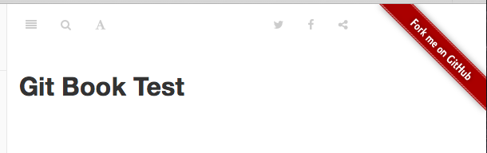
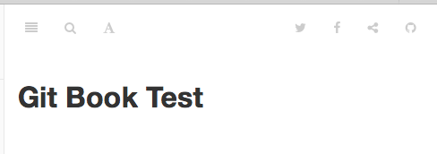

# Fork Me GitBook Plugin

Display a ribbon linked to your GitHub repo in your gitbook.

[![NPM version][npm-image]][npm-url]
[![License][license-image]][license-url]
[![Downloads][downloads-image]][downloads-url]

[Plugin Page][plugin-url]

## Image

### Longer Page Width



### Short Page Width



## Usage

Put this in your `book.json`:

```
{
  "plugins": [ "forkmegithub" ],
  "pluginsConfig": {
    "forkmegithub": {
      "url": "https://github.com/your/repo"
    }
  }
}
```

### Properties

 * url: Your github repository
 * color: Ribbon color (default: gray)
   * gray, darkblue, red, green, orange

## Contributing

Hope your request!

Fork [me][github-url] on GitHub, and [request][github-pr-url] your fix in this!

[github-url]: https://github.com/mizunashi-mana/gitbook-plugin-forkmegithub
[github-pr-url]: https://github.com/mizunashi-mana/gitbook-plugin-forkmegithub/pulls
[npm-image]: https://img.shields.io/npm/v/gitbook-plugin-forkmegithub.svg?style=flat-square
[npm-url]: https:/npmjs.org/package/gitbook-plugin-forkmegithub
[license-image]: https://img.shields.io/npm/l/gitbook-plugin-forkmegithub.svg?style=flat-square
[license-url]: LICENSE
[downloads-image]: http://img.shields.io/npm/dm/gitbook-plugin-forkmegithub.svg?style=flat-square
[downloads-url]: https://npmjs.org/package/gitbook-plugin-forkmegithub
[plugin-url]: https://plugins.gitbook.com/plugin/forkmegithub

